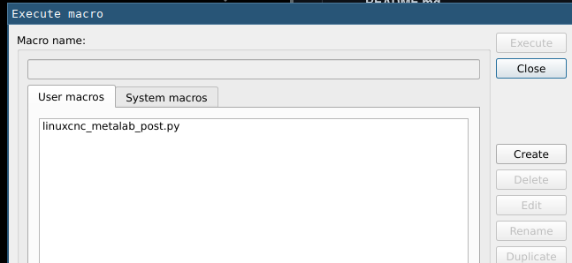

# FreeCAD CNC postprocessor for metalab CNC

[Metalab CNC](https://metalab.at/wiki/CNC-Fr%C3%A4se) doesn't work with the default LinuxCNC GCode FreeCAD generates. This is a postprocessor to adapt it.

## Installation

1. Navigate to the menu Macro → Macros...
2. Press the "Create" button 
3. A new dialog asking for a file name pops up. Enter "linuxcnc_metalab_post.py" and press Ok.
4. A new window pops up, containing a text editor.
5. Copy the contents of the file "linuxcnc_metalab_post.py" from this repository into the clipboard and paste it into this text editor.
6. Save the file, restart FreeCAD.
7. Job / Output / Processor: select `linuxcnc_metalab`
8. generate GCode like normal
